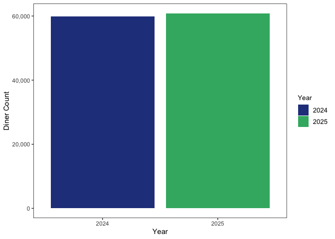
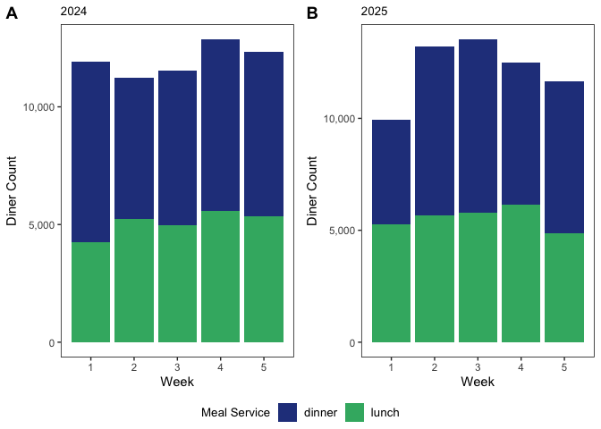

analysis
================

## packages

``` r
library(tidyverse)
```

    ## ── Attaching core tidyverse packages ──────────────────────── tidyverse 2.0.0 ──
    ## ✔ dplyr     1.1.4     ✔ readr     2.1.5
    ## ✔ forcats   1.0.0     ✔ stringr   1.5.1
    ## ✔ ggplot2   3.5.1     ✔ tibble    3.2.1
    ## ✔ lubridate 1.9.3     ✔ tidyr     1.3.1
    ## ✔ purrr     1.0.2     
    ## ── Conflicts ────────────────────────────────────────── tidyverse_conflicts() ──
    ## ✖ dplyr::filter() masks stats::filter()
    ## ✖ dplyr::lag()    masks stats::lag()
    ## ℹ Use the conflicted package (<http://conflicted.r-lib.org/>) to force all conflicts to become errors

``` r
library(scales)
```

    ## 
    ## Attaching package: 'scales'
    ## 
    ## The following object is masked from 'package:purrr':
    ## 
    ##     discard
    ## 
    ## The following object is masked from 'package:readr':
    ## 
    ##     col_factor

``` r
library(ggpubr)
```

## data

``` r
diner_counts <- read.csv("/Users/kenjinchang/github/ucm-sales/data/diner-counts.csv")
diner_counts
```

    ##    period week mealservice diner_count
    ## 1    2024    1       lunch        4248
    ## 2    2024    2       lunch        5223
    ## 3    2024    3       lunch        4967
    ## 4    2024    4       lunch        5571
    ## 5    2024    5       lunch        5347
    ## 6    2024    1      dinner        7657
    ## 7    2024    2      dinner        6030
    ## 8    2024    3      dinner        6584
    ## 9    2024    4      dinner        7296
    ## 10   2024    5      dinner        6989
    ## 11   2025    1       lunch        5260
    ## 12   2025    2       lunch        5677
    ## 13   2025    3       lunch        5775
    ## 14   2025    4       lunch        6164
    ## 15   2025    5       lunch        4849
    ## 16   2025    1      dinner        4675
    ## 17   2025    2      dinner        7539
    ## 18   2025    3      dinner        7755
    ## 19   2025    4      dinner        6331
    ## 20   2025    5      dinner        6799

``` r
diner_counts <- diner_counts %>%
  mutate(period=as.character(period))
```

``` r
diner_counts %>%
  group_by(period,week,mealservice) %>%
  summarise(sum(diner_count)) 
```

    ## `summarise()` has grouped output by 'period', 'week'. You can override using
    ## the `.groups` argument.

    ## # A tibble: 20 × 4
    ## # Groups:   period, week [10]
    ##    period  week mealservice `sum(diner_count)`
    ##    <chr>  <int> <chr>                    <int>
    ##  1 2024       1 dinner                    7657
    ##  2 2024       1 lunch                     4248
    ##  3 2024       2 dinner                    6030
    ##  4 2024       2 lunch                     5223
    ##  5 2024       3 dinner                    6584
    ##  6 2024       3 lunch                     4967
    ##  7 2024       4 dinner                    7296
    ##  8 2024       4 lunch                     5571
    ##  9 2024       5 dinner                    6989
    ## 10 2024       5 lunch                     5347
    ## 11 2025       1 dinner                    4675
    ## 12 2025       1 lunch                     5260
    ## 13 2025       2 dinner                    7539
    ## 14 2025       2 lunch                     5677
    ## 15 2025       3 dinner                    7755
    ## 16 2025       3 lunch                     5775
    ## 17 2025       4 dinner                    6331
    ## 18 2025       4 lunch                     6164
    ## 19 2025       5 dinner                    6799
    ## 20 2025       5 lunch                     4849

``` r
year_comparison <- diner_counts %>%
  ggplot(aes(x=period,y=diner_count,fill=period)) +
  geom_col() + 
  scale_fill_manual(values=c("royalblue4","mediumseagreen"),name="Year") +
  scale_y_continuous(labels=comma) +
  xlab("Year") + 
  ylab("Diner Count") +
  theme(panel.grid=element_blank(),panel.background=element_rect(fill="white"),panel.border=element_rect(fill=NA),legend.title=element_text(size=10),legend.text=element_text(size=10),plot.title=element_text(size=10))
ggsave(filename="year_comparison.png",plot=year_comparison,path="/Users/kenjinchang/github/ucm-sales/figures",width=22,height=16,units="cm",dpi=150,limitsize=TRUE)
year_comparison
```

<!-- -->

``` r
twentyfour <- diner_counts %>%
  filter(period=="2024") %>%
  ggplot(aes(x=week,y=diner_count,fill=mealservice)) + 
  geom_col() + 
  scale_fill_manual(values=c("royalblue4","mediumseagreen"),name="Meal Service") +
  scale_y_continuous(labels=comma) +
  xlab("Week") + 
  ylab("Diner Count") +
  labs(title="2024") +
  theme(panel.grid=element_blank(),panel.background=element_rect(fill="white"),panel.border=element_rect(fill=NA),legend.title=element_text(size=10),legend.text=element_text(size=10),plot.title=element_text(size=10))
```

``` r
twentyfive <- diner_counts %>%
  filter(period=="2025") %>%
  ggplot(aes(x=week,y=diner_count,fill=mealservice)) + 
  geom_col() + 
  scale_fill_manual(values=c("royalblue4","mediumseagreen"),name="Meal Service") +
  scale_y_continuous(labels=comma) +
  xlab("Week") + 
  ylab("Diner Count") +
  labs(title="2025") +
  theme(panel.grid=element_blank(),panel.background=element_rect(fill="white"),panel.border=element_rect(fill=NA),legend.title=element_text(size=10),legend.text=element_text(size=10),plot.title=element_text(size=10))
```

``` r
year_distributions <- ggarrange(twentyfour,twentyfive,
          labels=c("A","B"),
          common.legend=TRUE,
          legend="bottom")
ggsave(filename="year_distributions.png",plot=year_distributions,path="/Users/kenjinchang/github/ucm-sales/figures",width=34,height=16,units="cm",dpi=150,limitsize=TRUE)
year_distributions
```

<!-- -->
